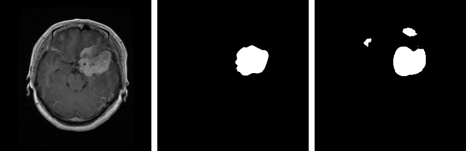
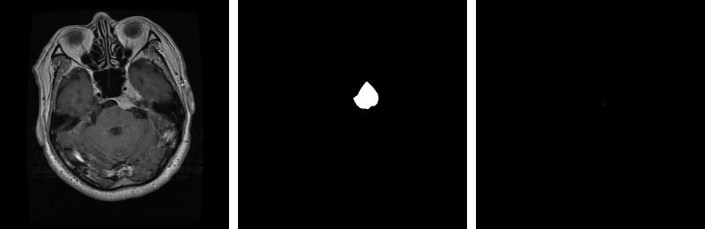
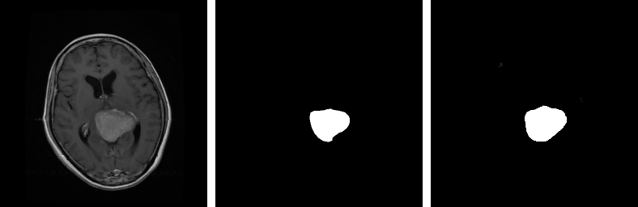
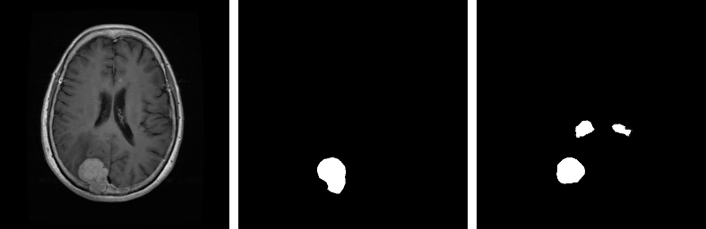

# Brain-Tumor-Segmentation-using-UNETR-in-TensorFlow
This repository demonstrates the utilization of UNETR for brain tumor segmentation.
.

## Architecture

|  |
| :--: |
| *The block diagram of the Original UNETR model.* |

## Dataset
LaPa stands for Landmark guided face Parsing dataset (LaPa). It is a large-scale dataset for human face parsing. It consists of more than 22,000 facial images with abundant variations in expression, pose and occlusion, and each image of LaPa is provided with a 11-category pixel-level label map and 106-point landmarks.
   
Download the dataset: [Brain Tumor Segmentation](https://www.kaggle.com/datasets/nikhilroxtomar/brain-tumor-segmentation)
   
For more: [Brain Tumor Segmentation]([https://github.com/jd-opensource/lapa-dataset](https://figshare.com/articles/dataset/brain_tumor_dataset/1512427))

## Results
The sequence in the images below is `Input Image`, `Ground Truth` and `Prediction`.    
|  |
| :--: |
|  |
|  |
|  |
|  |

## How to improve
- Train on more epochs.
- Increase the input image resolution.
- Apply data augmentation.

## Contact
For more follow me on:

- <a href="https://www.youtube.com/idiotdeveloper"> YouTube </a>
- <a href="https://facebook.com/idiotdeveloper"> Facebook </a>
- <a href="https://twitter.com/nikhilroxtomar"> Twitter </a>
- <a href="https://www.instagram.com/nikhilroxtomar"> Instagram </a>
- <a href="https://t.me/idiotdeveloper"> Telegram </a>
